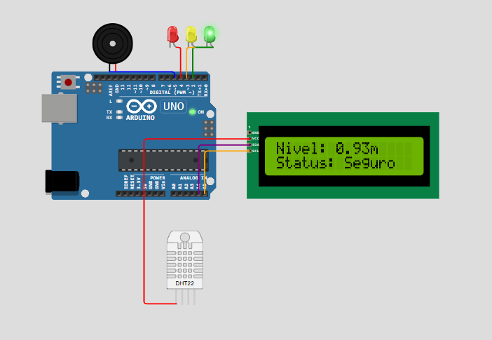

# 🌊 HydroGuard – Monitoramento Inteligente de Nível de Água

**Curso:** Engenharia de Software – FIAP  
**Disciplina:** Edge Computing & IoT  
**Projeto:** CP2 – Monitoramento de Enchentes

---

## 📌 Descrição

O **HydroGuard** é um sistema de monitoramento de nível de água baseado em Arduino, desenvolvido para detectar e alertar sobre riscos de enchentes em áreas ribeirinhas. Utilizando sensores e atuadores, o sistema fornece alertas visuais e sonoros em tempo real, permitindo ações preventivas em situações de risco.

---

## 🎯 Objetivo

Desenvolver uma solução de Edge Computing que monitore o nível de água de um rio ou reservatório, emitindo alertas locais conforme os níveis de risco, sem depender de conexões com a nuvem.

---

## 🧰 Componentes Utilizados

- **Arduino Uno**
- **Sensor de Nível de Água** (simulado por potenciômetro)
- **Display LCD 16x2 com I2C**
- **LEDs**: Verde (seguro), Amarelo (atenção), Vermelho (risco)
- **Buzzer**: Alerta sonoro em caso de risco
- **Protoboard e jumpers**

---

## 🧠 Lógica de Funcionamento

O sistema realiza leituras periódicas do nível de água e classifica o estado atual conforme os seguintes critérios:

| Nível da Água (m) | Estado           | Ações                                                       |
|-------------------|------------------|-------------------------------------------------------------|
| ≤ 1.00            | Seguro           | LED Verde aceso                                             |
| 1.01 – 1.50       | Atenção          | LED Amarelo aceso                                           |
| 1.51 – 2.00       | Risco            | LED Vermelho aceso                                          |
| > 2.00            | Emergência       | LED Vermelho aceso + Buzzer ativado                         |

As leituras são suavizadas através da média de múltiplas amostras para reduzir flutuações e melhorar a precisão.

---

## 💻 Código-Fonte

O código está disponível no arquivo `Hydroguard.ino`, que inclui:

- Leitura do sensor de nível de água com média de 5 amostras
- Conversão da leitura para metros
- Lógica de decisão para acionar LEDs e buzzer
- Exibição das informações no display LCD
- Comunicação via Serial Monitor para debug

---

## 🔌 Diagrama de Montagem

O diagrama de montagem está disponível no arquivo `diagram.json`, compatível com o simulador Wokwi.

---

## 🧪 Simulação no Wokwi

Você pode testar o projeto diretamente no simulador Wokwi através do seguinte link:

🔗 [Simular HydroGuard no Wokwi](https://wokwi.com/projects/432873907573088257)

---

## 📹 Demonstração

📽️ [Link para vídeo explicativo do projeto no YouTube ou Google Drive](https://www.youtube.com/watch?v=pGiUOH7qjWI)

---

## 📦 Arquivos para Entrega

- `Hydroguard.ino`: Código-fonte do projeto
- `diagram.json`: Diagrama de montagem
- `README.md`: Este arquivo de documentação

---

## ✅ Conclusão

O projeto HydroGuard atende aos requisitos da CP de Edge Computing, oferecendo uma solução prática e eficiente para monitoramento de enchentes. A implementação local garante independência de conexões externas, proporcionando alertas em tempo real para ações preventivas.

---

**Autores:** 

- Bernardo Lozório Gomes Y Gomes | RM: 564943
- Lucas Salviato Marson | RM: 563975
- Pedro Alves Simão | RM: 564065
